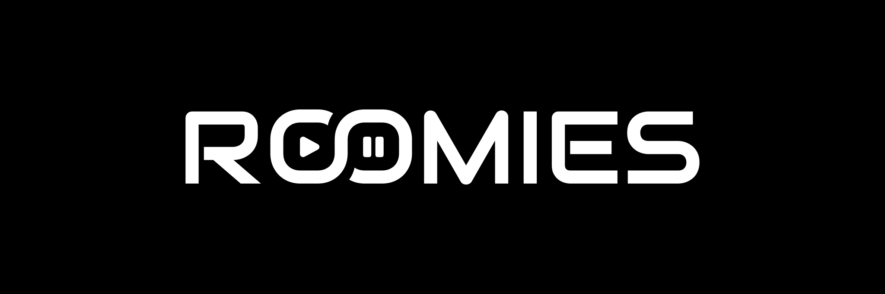

<p align="center">
  
</p>

<p align="center">
  <strong>A modern, self-hosted, real-time media watch party platform.</strong>
</p>

<p align="center">
  <a href="https://github.com/JustModo/roomies/stargazers"></a>
  <a href="https://github.com/JustModo/roomies/network/members"></a>
  <a href="https://github.com/JustModo/roomies/releases"></a>
  <a href="LICENSE"></a>
</p>

---

## Motivation

Watching media remotely with friends often requires managing separate tools for video playback, voice chat, and messaging, or relying on third-party services with privacy and streaming quality limitations.

Roomies was created to provide a unified, self-hosted watch party solution. It pairs low-latency video synchronization with real-time transcoding, built-in voice channels, and interactive reactions in a single application you control on your own infrastructure.

<p align="center">
  
  
  
  
  
</p>

---

## Prerequisites

- **Docker and Docker Compose** (for containerized deployment)
- **Node.js 18+** and **pnpm** (for local development)

---

## Quick Start

1. **Clone the repository:**
   ```bash
   git clone https://github.com/JustModo/roomies.git
   cd roomies
   ```

2. **Start the service:**
   ```bash
   docker compose up --build -d
   ```

3. **Access the application:**
   Open `http://localhost:5123` in your browser.

---

## Development Mode

1. **Install dependencies:**
   ```bash
   pnpm install
   ```

2. **Start the development server:**
   ```bash
   pnpm dev
   ```

3. **Access the development environment:**
   Open `http://localhost:5123` in your browser.

---

## Hardware Acceleration

To enable GPU acceleration, edit `docker-compose.yml`:

### Intel or AMD GPU (VAAPI / QSV)

Uncomment the `devices` block:
```yaml
devices:
  - /dev/dri:/dev/dri
```

### NVIDIA GPU (NVENC)

Uncomment the `deploy` block:
```yaml
deploy:
  resources:
    reservations:
      devices:
        - driver: nvidia
          count: 1
          capabilities: [gpu, video, compute, utility]
```

---

## License

This project is licensed under the **GNU General Public License v2.0**. See the [LICENSE](LICENSE) file for details.
